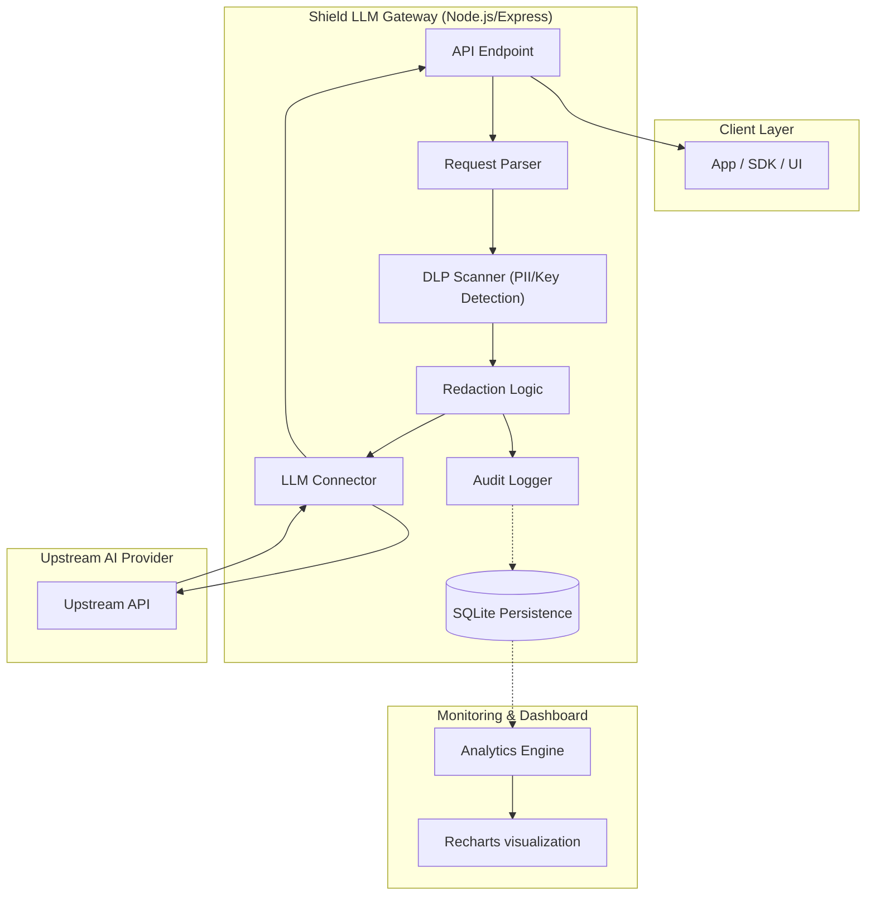
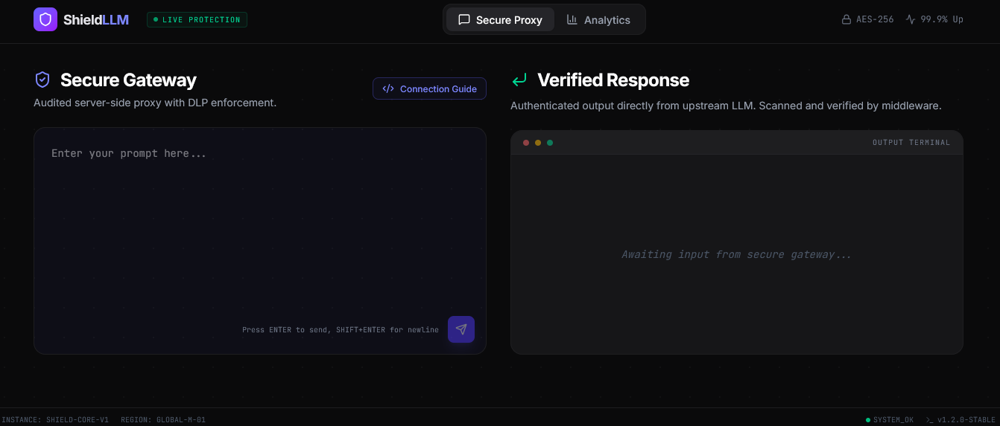
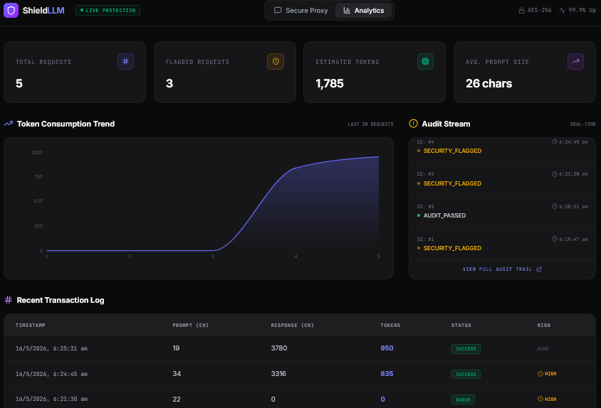

# Shield LLM Gateway 🛡️

Shield LLM Gateway is a high-performance enterprise security proxy and middleware layer for large language models. It provides real-time Data Loss Prevention (DLP), audit logging, and usage analytics with a focus on zero-latency overhead.

## 🚀 Drop-in Integration

The Shield LLM Gateway acts as a compatible security layer for standard LLM providers. By simply updating the `baseURL` in their existing code, team members can route traffic through this gateway to gain enterprise-grade auditing and DLP redaction without changing their existing LLM provider.

### OpenAI SDK (Python)
```python
from openai import OpenAI

client = OpenAI(
    base_url="https://[YOUR_APP_URL]/v1",
    api_key="proxy-managed" # Key is handled by middleware
)

response = client.chat.completions.create(
    model="shield-llm-v1",
    messages=[{"role": "user", "content": "Analyze company-secret@example.com"}]
)
# Note: The email above will be redacted before hitting the upstream LLM
```

### Claude SDK (Node.js)
```javascript
import Anthropic from '@anthropic-ai/sdk';

const anthropic = new Anthropic({
  baseURL: "https://[YOUR_APP_URL]/v1",
  apiKey: "proxy-managed",
});

const msg = await anthropic.messages.create({
  model: "claude-3-5-sonnet-proxy",
  messages: [{ role: "user", content: "Hello, proxy!" }],
});
```

---

## 📐 System Architecture

### High-Level Data Flow
The diagram below illustrates how Shield LLM Gateway intercepts, sanitizes, and audits traffic between your internal applications and the upstream LLM. (This diagram is rendered natively by GitHub).



### 📸 Application Demos
To see Shield LLM Gateway in action, you can view the integrated dashboard.

| Secure Gateway | Analytics Dashboard |
| :---: | :---: |
|  |  |

### Detailed Component Flow
1.  **Ingress Interception**: The proxy receives requests via standard LLM endpoints (`/v1/chat/completions`).
2.  **DLP Scanning (Fast-Path)**: The request content is passed through a high-performance regex engine that identifies patterns corresponding to PII (Emails, Credit Cards) and Security Credentials (API Keys, private-keys).
3.  **Audit Enforcement**: Before any data leaves the secure environment, an entry is written to the **Low-Latency SQLite DB**. This ensures that even if the upstream LLM fails, we have a record of the attempted input.
4.  **Upstream Synthesis**: The *redacted* version of the prompt (e.g., swapping `user@company.com` for `[REDACTED_EMAIL]`) is sent to the Upstream LLM.
5.  **Response Verification**: The response is captured, token estimations are calculated, and the audit log is updated with the final transaction status.

---

## 🏗️ Architecture & Trade-offs

### 1. Persistence: SQLite (`better-sqlite3`)
**Choice:** I selected SQLite for audit persistence.
- **Why:** In a middleware context, latency is the primary enemy. SQLite runs in-process, meaning the "Audit Write" happens with sub-millisecond latency before the LLM request is proxied.
- **Trade-off:** SQLite is limited in horizontal scaling scenarios.
- **Production Path:** For a high-traffic distributed environment, one would swap SQLite for **Postgres (with pgpool)** for persistence and **Redis** for real-time counters/rate-limiting.

### 2. Security: DLP & Redaction
**Choice:** Regex-based PII scanning followed by structured JSON reporting.
- **Why:** Provides immediate protection against the most common data leaks (Emails, API Keys, Passwords) without the cost of a secondary "scanning" LLM call.
- **Trade-off:** Basic regex might miss complex PII patterns.
- **Production Path:** Integrate with dedicated services like Cloud DLP APIs for advanced document scanning.

### 3. Deployment: Full-Stack Middleware
**Choice:** Integrated Express + Vite server.
- **Why:** Simplifies the deployment surface. The proxy and the analytics dashboard live together, ensuring the dashboard always has direct access to the local audit logs.

---

## 📊 Feature Highlights

- **Stealth Redaction:** Automatically detects and replaces sensitive info with tokens like `[REDACTED_EMAIL]`.
- **Usage Analytics:** Real-time token estimation and request volume tracking.
- **Risk Scoring:** Assigns a risk score to every request based on flagged keywords and redaction counts.
- **Structured Auditing:** Every transaction produces a unique `txId` compatible with downstream logging systems (ELK, Splunk).

## 🛠️ Setup
1. Define your AI Provider API Key in your environment secrets.
2. The proxy binds to port `3000`.
3. Access the Dashboard at `/` to see live audit logs.
